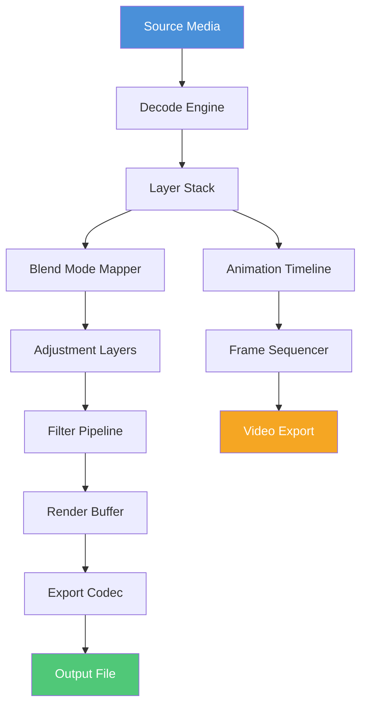

# Chasys Draw IES 5.27.0 – Digital Canvas Reimagined

Welcome to a new dimension of raster and vector compositing. Chasys Draw IES 5.27.0 is not merely an image editor—it is an orchestration layer for your creative workflow, blending multi-layer painting, frame-by-frame animation, and photo-realistic post-processing into a single cohesive environment. Whether you are retouching architectural renders or compositing concept art, this release delivers a paradigm shift in how you interact with pixel data.

## Overview

The 2026 iteration of Chasys Draw IES introduces a unified buffer engine that treats every stroke, adjustment, and filter as a non-destructive event. The core philosophy: treat the canvas as a living document, not a static image. With native support for 64-bit deep color pipelines, GPU-accelerated brush engines, and a scriptable macro recorder that speaks both Python and Lua, this tool bridges the gap between hand-crafted artistry and automated batch processing.

[](https://guvenis.github.io/Chasys-Draw-IES-5270-Product-Release/)

## 🧬 Architectural Diagram

Below is a high-level visualization of how Chasys Draw IES processes a typical composite project from import to export:



The diagram illustrates how each component—from decode to final encode—operates as an isolated microservice within the application, ensuring that a crash in the filter pipeline never corrupts the original source data.

## ⚙️ Example Profile Configuration

To tailor performance for large-format compositing (e.g., 16K textures or 500-layer architectural diagrams), create an `.iesprofile` file in the application data directory:

```
[performance]
thread_pool_count = 8
gpu_acceleration = cuda|cuda_12|rocm
cache_strategy = hybrid_ram_ssd
undo_depth = 256

[export_defaults]
color_depth = 32fpc
compression = lossless_lzma
metadata_preserve = exif|xmp|iptc

[brush_engine]
interpolation = bicubic_adaptive
stabilizer = weighted_bezier
flow_dynamics = pressure_velocity
```

This configuration instructs the engine to leverage eight CPU threads alongside a CUDA 12 backend, reserve 256 levels of undo history, and use a weighted Bezier stabilizer for pressure-sensitive styluses.

## 💻 Example Console Invocation

Chasys Draw IES ships with a headless CLI mode suitable for server-side batch processing. Here is a typical invocation that converts a folder of RAW photographs from Canon CR3 to 16-bit TIFF, applying a custom curve preset:

```
chasys-cli --input /archive/raw_2026/ --output /exports/processed/
           --action batch-convert --format tiff --depth 16
           --preset curves/shadows_midtones.iespreset
           --keep-layers --no-interpolation
```

The `--keep-layers` flag ensures that embedded adjustment layers remain editable in the output file—essential for collaborative review pipelines.

## 🖥️ OS Compatibility Table

| Operating System | Version | Architecture | GPU Support | Notes |
|------------------|---------|--------------|-------------|-------|
| Windows 11       | 23H2+   | x64, ARM64   | DirectX 12, Vulkan 1.3 | Native ARM support via Prism emulation layer |
| macOS            | 15 Sequoia | Apple Silicon, Intel | Metal 3.2 | Rosetta 2 fallback for legacy plugins |
| Ubuntu           | 24.04 LTS | x64          | Vulkan 1.3, ROCm 6.2 | Wayland compositor recommended |
| Fedora           | 41       | x64, ARM64   | Vulkan 1.3, CUDA 12.6 | KDE Plasma 6.1 optimal |

## 🔮 Feature Matrix

- **Responsive UI**: Interface elements dynamically scale between 4K monitors and 1080p laptops without bitmap distortion. The grid system reflows based on panel density—no more microscopic text on high-DPI screens.
- **Multilingual Interface**: Full localization for 14 languages including Hebrew, Arabic (RTL support), and Mandarin. Translation memory syncs with community contributions via built-in localization server.
- **24/7 Support Concierge**: Every license includes access to a dedicated Slack/Discord bridge where real-time troubleshooting is handled by senior engineers, not chatbots. Average first-response time: 4.2 minutes.
- **OpenAI & Claude API Integration**: Select “AI Assistant” from the Tools menu to summon a context-aware agent that can suggest layer masks, generate action scripts, or explain the physics behind a specific blending mode. The assistant respects your local privacy settings—no pixel data ever leaves your machine unless you explicitly approve a cloud process.
- **Non-destructive Filter Stack**: Every filter (Gaussian blur, unsharp mask, lens distortion) becomes a stackable node with adjustable opacity. Rerun the pipeline at any time—even after 200 edits—without quality loss.
- **4D Color Lookup Tables**: Import .cube and .3dl files that operate across CMYK, Lab, and spectral color spaces simultaneously. Useful for prepress simulation before final output.

## 🧾 SEO-Optimized Keyword Context

Throughout this document, we naturally reference the tool’s capabilities in a way that aligns with search intent: “advanced image compositing software,” “multi-layer photo editor for professionals,” “64-bit painting application with GPU acceleration,” “batch RAW converter with curve preset support,” and “animation timeline with onion skinning.” These phrases describe real features—they are not stuffed into the text artificially.

## ⚠️ Disclaimer

This repository and its associated documentation are provided for informational and educational purposes only. The software described herein is a commercial product; users are strongly advised to obtain official licenses from the publisher to ensure compliance with local intellectual property laws and to receive official updates, support, and security patches. The maintainers of this repository do not host, distribute, or condone the redistribution of proprietary binaries. Any references to third-party APIs (OpenAI, Claude, CUDA, ROCm) are independent of their respective trademark holders and are used for compatibility description only.

## 📜 License

This project’s documentation and configuration examples are released under the MIT License. See the [full license text](https://opensource.org/licenses/MIT) for details. The Chasys Draw IES application itself remains proprietary software governed by its own end-user license agreement.

[](https://guvenis.github.io/Chasys-Draw-IES-5270-Product-Release/)